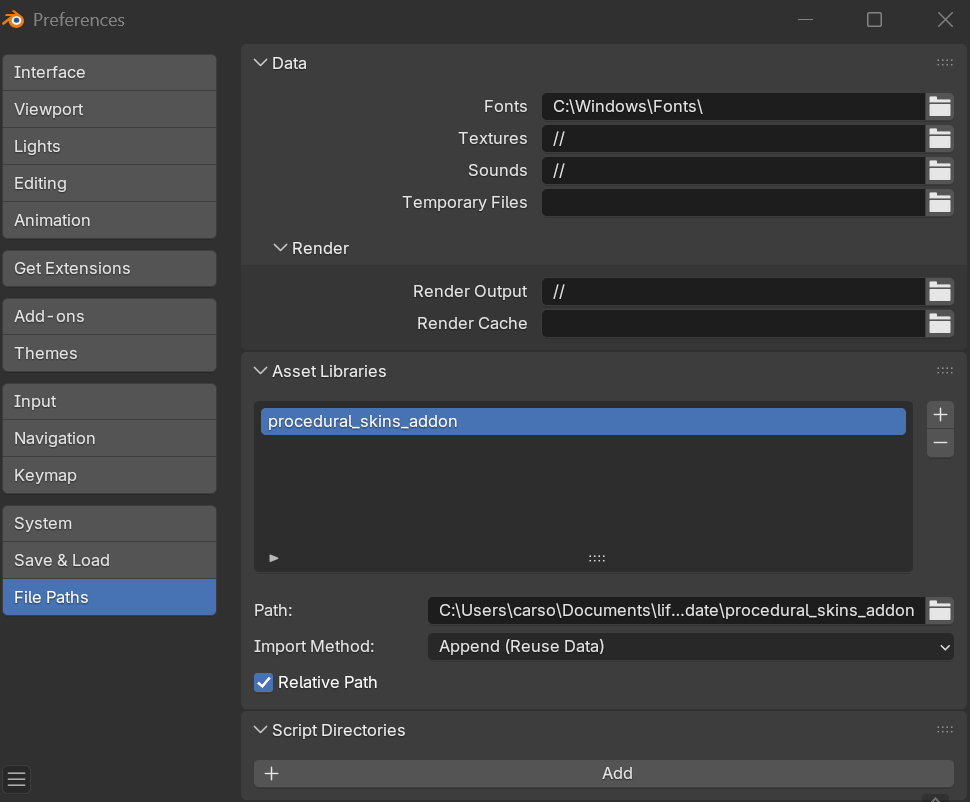

# Procedural Artificial Skin Sensors for Blender
###### *Note: The export addon is not currently supported in GenTact 2.0, this functionality may be added in future updates*

### Overview
This repo provides a set of premade geometry nodes that can be dragged and dropped on any given mesh to generate 3D-printable artificial skin sensors. The following nodes are currently included with more to come in future updates:
- **Dermis layer** --- A structural layer that is flush-fit to the original mesh.
- **Self-capacitance layer** --- Distributed disks for capacitive touch points.
- **Custom sensor mount layer** --- Distributed mounts for a given premade sensor mesh.
- **Wire generation layer** --- Connects sensors to connection ports for a microcontroller.

### Installation
This repo is compatible with **Blender 5.1** and will not work with earlier releases. Use the follow commands to build the extension as a zip file that can be imported.

```bash
cd procedural_skins_addon
blender --command extension build
```
Import the zip file via Edit > Preferences > Get Extensions > Install from Disk

### Alternative Installation

Each node is provided as an *Asset* and can be accessed through the *Asset Browser* in Blender. To add the nodes to the *Asset Browser*, include the path to the *procedural_skins_addon* through the following steps:
1) Navigate to *Edit* > *Preferences*
2) Add *procedural_skins_addon* ot the Asset Libraries file paths
   

### Usage
Open an asset browser tab and drag and drop the desired layers onto your CAD model. A more detailed tutorial on how to create a skin unit is found [here](https://www.youtube.com/watch?v=qH5VpunpglI).
